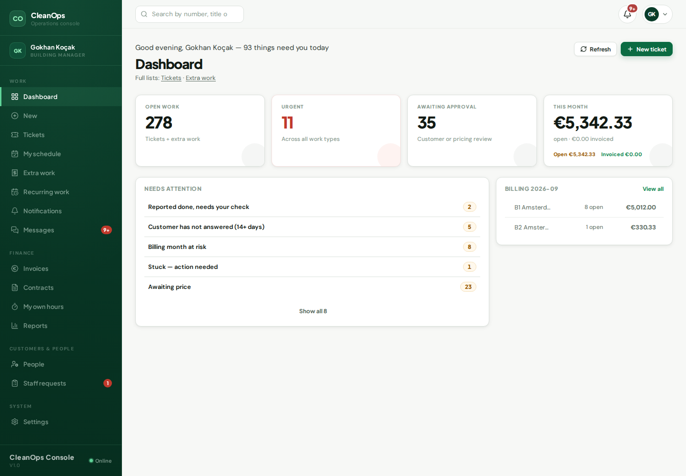

# Beheerder (gebouw) / Building manager

## Wat u ziet als u inlogt

Het **Dashboard**, gefilterd op uw gebouwen: de aandachtslijst en het
open werk van de gebouwen die aan u zijn toegewezen. U ziet nooit werk
van gebouwen die niet van u zijn.

## De vijf dingen die u het vaakst doet

1. **Tickets** — meldingen van uw gebouwen: mensen toewijzen, de
   status verder brengen, de klant antwoorden via Berichten.
2. **Werkplanning** — de week van het team op uw gebouwen; de strook
   "Niet gepland" toont wat een dag nodig heeft.
3. **Meerwerk** — aanvragen prijzen en de offerte klaarzetten.
   Versturen van meerwerk-offertes mag u; het uitgeven en versturen
   van FACTUREN is voor de bedrijfsbeheerder (het systeem zegt dat er
   ook bij als u het probeert).
4. **Uren** — uren invoeren voor uw mensen; de week sluiten doet u
   samen met kantoor.
5. **Facturen (lezen + concept)** — u ziet wat er klaarstaat voor uw
   klanten en maakt concepten; de knop "verstuur" is bewust niet van u.

## Waar het geld staat

Onder **Facturen** (lezen) en Meerwerk's tabblad "Te factureren". Wat
u prijst en de klant goedkeurt, verschijnt daar vanzelf zodra het werk
is afgerond en gecontroleerd.

## Als iets vastzit

De strook "Vastgelopen" op de Werkplanning noemt het werk dat stil
staat. Werk dat te lang op uw controle wacht, krijgt u per mail én in
de bel — dezelfde regel, twee kanalen.

---

# English

## What you see at login

The **Dashboard**, filtered to your buildings: the attention list and
open work of the buildings assigned to you. You never see another
building's work.

## The five things you will do most

1. **Tickets** — your buildings' reports: assign people, move the
   status, answer the customer through Berichten.
2. **Werkplanning** — the team's week on your buildings; the "Not
   planned" strip shows what needs a day.
3. **Meerwerk** — price requests and prepare the quote. Sending
   meerwerk quotes is yours; issuing and sending INVOICES belongs to
   the company admin (the system says so if you try).
4. **Uren** — enter hours for your people; closing the week happens
   with the office.
5. **Facturen (read + draft)** — you see what is ready for your
   customers and create drafts; the send button is deliberately not
   yours.

## Where the money is

Under **Facturen** (read) and Meerwerk's "To invoice" tab. What you
price and the customer approves appears there once the work is
finished and checked.

## When something is stuck

The board's "Stuck" strip names the work that stopped. Work waiting
too long on your check reaches you by mail AND the bell — one line,
two channels.
