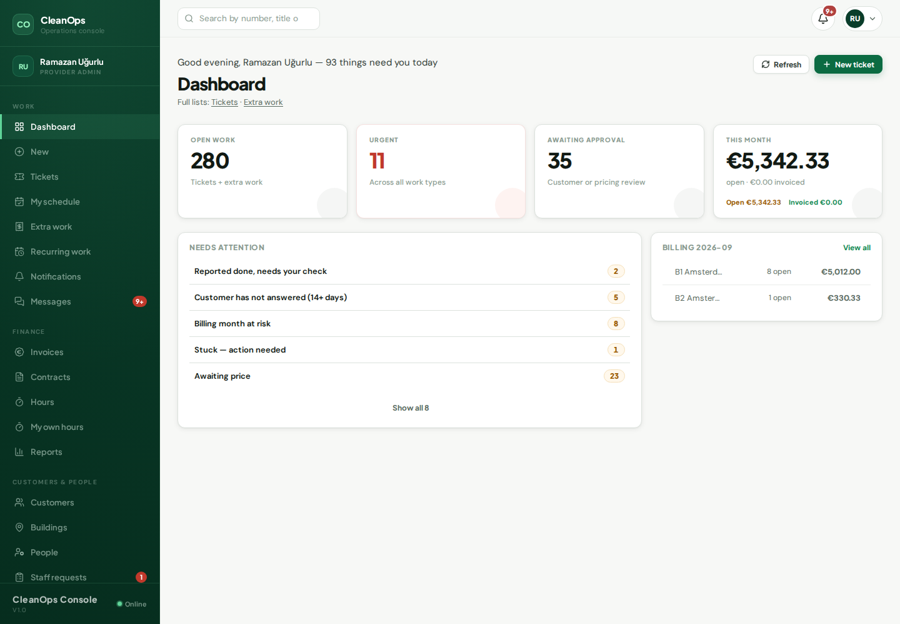

# Bedrijfsbeheerder / Company admin

## Wat u ziet als u inlogt

Het **Dashboard**: een begroeting die zegt hoeveel dingen u vandaag
nodig hebben, daaronder "Aandacht nodig" en het openstaande werk. Die
lijst noemt de soorten werk die op u wachten — klaar gemeld wacht op
uw controle, klant heeft niet geantwoord, factuurmaand loopt risico,
vastgelopen, wacht op prijs, hier zit nog niemand op, nog niet
gepland, wacht op klantbeslissing — maar alleen de soorten waar iets
in zit. U ziet de vijf dringendste; "Toon alle" toont de rest. Elke
regel is een deur: klikken brengt u bij precies die lijst.

## De vijf dingen die u het vaakst doet

1. **Tickets** — meldingen van klanten bekijken, mensen toewijzen, de
   status verder brengen. De teller zegt zelf welke periode hij telt.
2. **Werkplanning** — zo heet het in het menu; de pagina zelf heet
   "Werkplanning van het team". De week van het team: sleep niets,
   elke kaart opent zijn eigen ticket, en de strook "Nog niet gepland"
   toont wat nog geen dag heeft.
3. **Meerwerk** — nieuwe aanvragen prijzen ("Prijzen en versturen"
   opent de offertebouwer; er gaat pas iets naar de klant als ú
   verstuurt).
4. **Uren** — de weekstaat van het bedrijf: uren invoeren, de week
   sluiten. Alleen goedgekeurde vaste patronen vullen de staat vooraf.
5. **Facturen** — concepten controleren, uitgeven, versturen. Het
   nummer komt pas bij het versturen; een verstuurde factuur is
   onveranderbaar (correctie = creditnota).

## Waar het geld staat

**Facturen** toont wat klaarstaat en wat verstuurd is; het tabblad
"Te factureren" onder Meerwerk toont afgerond werk dat nog op geen
factuur staat. Het voorbeeld in het venster van "Concept maken" toont
precies wat de knop gaat factureren.

## Als iets vastzit

De lijst "Aandacht nodig" op het Dashboard en de strook
"Vastgelopen — actie nodig" op de Werkplanning noemen het werk dat
stilstaat en wie aan zet is. Elke
waarschuwingsmail heeft dezelfde regel ook in de bel rechtsboven.

---

# English

## What you see at login

The **Dashboard**: a greeting with how many things need you today,
"Needs attention" below it and the open work. That list names the kinds
of work waiting on you — reported done needs your check, customer has
not answered, billing month at risk, stuck, awaiting price, nobody is
on these yet, not planned yet, awaiting customer decision — but only
the kinds with something in them. You see the five most urgent; "Show
all" reveals the rest. Every row is a door to exactly that list.

## The five things you will do most

1. **Tickets** — read customer reports, assign people, move the status
   forward. The counter says which period it counts.
2. **My schedule** — that is the menu name; the page itself is titled
   "Team schedule". The team's week: every card opens its own ticket,
   and the "Not planned yet" strip shows what has no day yet.
3. **Extra work** — price new requests ("Price and send" opens the
   quote builder; nothing reaches the customer until YOU send).
4. **Hours** — the company's week sheet: enter hours, close the week.
   Only approved standing patterns pre-fill it.
5. **Invoices** — check drafts, issue, send. The number arrives at
   SEND; a sent invoice is immutable (correction = credit note).

## Where the money is

**Invoices** shows what is ready and what went out; Extra work's "To
invoice" tab shows finished work not yet on any invoice. The preview
in the "Make a draft" dialog shows exactly what the button will bill.

## When something is stuck

The Dashboard's "Needs attention" list and the schedule's "Stuck —
action needed" strip name the work that stopped and whose move it is.
Every warning mail also lands as the same line in the bell, top
right.
