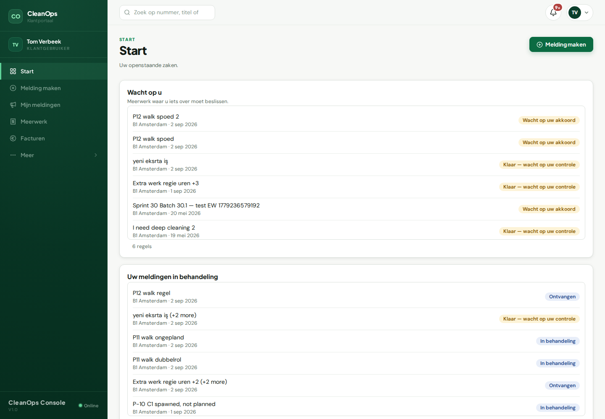

# Klant / Customer

## Wat u ziet als u inlogt

De **Start**-pagina: wat er nu speelt in uw gebouwen — meldingen die
lopen, meerwerk dat op uw akkoord wacht, en de deur "Melding maken".

## De vijf dingen die u het vaakst doet

1. **Melding maken** — iets kapot, vies of niet gedaan? Eén formulier;
   u krijgt bericht bij elke stap die volgt.
2. **Mijn meldingen** — al uw meldingen met hun status, in gewone
   woorden ("Wacht op beheerder", "Wacht op u").
3. **Meerwerk** — extra werk aanvragen en offertes beoordelen. Bij
   "Wacht op uw akkoord" beslist u: goedkeuren of afwijzen (afwijzen
   vraagt om een reden, zodat de schoonmaker weet waarom).
4. **Werk goedkeuren** — is het extra werk uitgevoerd, dan kijkt u het
   na en keurt u het af of goed. Let op: werk dat vóór uw
   facturatiedatum is afgerond, komt op de eerstvolgende factuur, ook
   als uw akkoord dan nog niet binnen is — wijst u het daarna af, dan
   volgt een creditnota.
5. **Facturen** — al uw verstuurde facturen met periode, status en
   totaal; elke regel opent de factuur zelf.

## Waar het geld staat

**Facturen**, in de linkerbalk. Alleen verstuurde facturen staan er —
een concept bij de schoonmaker is nog geen rekening van u.

## Als iets vastzit

Blijft een melding stil staan: open hem en stuur een bericht — dat
komt rechtstreeks bij de beheerder. De bel rechtsboven toont elk
antwoord en elke statuswijziging, in uw eigen taal.

---

# English

## What you see at login

The **Start** page: what is live in your buildings — running reports,
extra work waiting for your approval, and the "Melding maken" door.

## The five things you will do most

1. **Create a report** — something broken, dirty or skipped? One form;
   you are notified at every following step.
2. **Mijn meldingen** — all your reports with their status, in plain
   words ("Waiting for the manager", "Waiting for you").
3. **Meerwerk** — request extra work and judge quotes. At "Waiting for
   your approval" you decide: approve or reject (rejecting asks for a
   reason, so the cleaner knows why).
4. **Approve finished work** — when extra work is done, you review it
   and approve or reject. Note: work finished before your billing date
   goes on the next invoice even if your approval is not in yet — if
   you reject afterwards, a credit note follows.
5. **Facturen** — all your sent invoices with period, status and
   total; every row opens the invoice.

## Where the money is

**Facturen**, in the sidebar. Only sent invoices appear — a draft at
the cleaning company is not yet a bill of yours.

## When something is stuck

If a report sits still: open it and send a message — it lands directly
with the manager. The bell, top right, shows every answer and status
change, in your own language.
