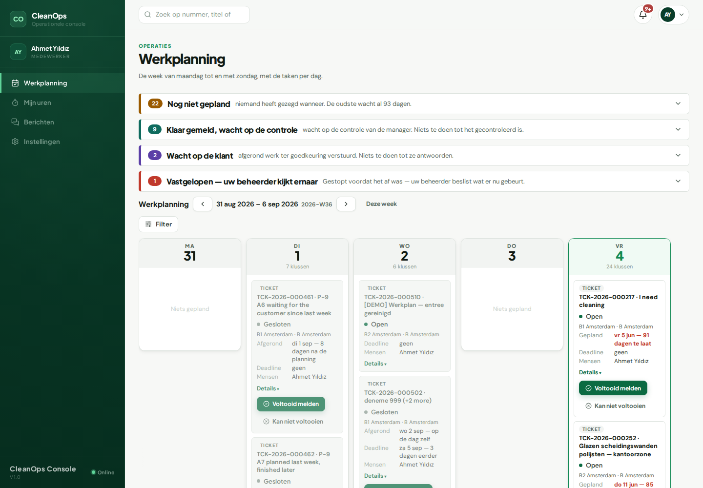

# Medewerker / Staff

## Wat u ziet als u inlogt

**Werkplanning** — uw eigen week: per dag de klussen waar u op staat,
met adres en tijd. Wat vandaag is, staat bovenaan. U ziet alleen uw
eigen werk.

## De vijf dingen die u het vaakst doet

1. **Uw dag lezen** — open Werkplanning; elke klus-kaart opent het
   ticket met de omschrijving en het gebouw.
2. **Werk afronden** — op het ticket meldt u de klus klaar (of "niet
   gelukt", met de reden). Uw beheerder controleert daarna; dat hoeft
   u niet zelf te regelen.
3. **Mijn uren** — uw uren per dag invoeren. Vaste afgesproken uren
   staan er al; u vult alleen aan wat anders was. Een dag in de
   toekomst krijgt een oranje merkteken — invullen mag, controleer de
   datum.
4. **Berichten** — vragen over een klus stelt u op het ticket zelf;
   het antwoord komt in Berichten en in de bel.
5. **Notificaties** — de bel rechtsboven: toewijzingen, herinneringen
   en wijzigingen, in uw eigen taal.

## Waar het geld staat

Niet bij u — uw uren zijn uw deel: wat u invoert in **Mijn uren**
telt in de weekstaat en de rapporten. Prijzen en facturen zijn voor
kantoor.

## Als iets vastzit

Kunt u een klus niet doen (geen sleutel, verkeerde dag): meld de klus
"niet gelukt" met de reden op het ticket. Daarmee ligt hij bij uw
beheerder — die beslist wat er daarna gebeurt. U hoeft niemand achterna
te bellen.

---

# English

## What you see at login

**My schedule** — your own week: per day the jobs you are on, with
address and time. Today sits on top. You only see your own work.

## The five things you will do most

1. **Read your day** — open My schedule; every job card opens its
   ticket with the description and the building.
2. **Finish work** — on the ticket, report the job done (or "could not
   finish", with the reason). Your manager checks it afterwards.
3. **My hours** — enter your hours per day. Agreed standing hours are
   already there; you only adjust what differed. A future day gets an
   amber mark — allowed, but check the date.
4. **Messages** — ask job questions on the ticket itself; the answer
   arrives in Messages and the bell.
5. **Notifications** — the bell, top right: assignments, reminders and
   changes, in your own language.

## Where the money is

Not with you — your hours are your part: what you enter in **My
hours** counts in the week sheet and the reports. Pricing and invoices
are the office's.

## When something is stuck

If you cannot do a job (no key, wrong day): report it "could not
finish" with the reason on the ticket. It is then with your manager —
they decide what happens next. You do not have to chase anyone.
